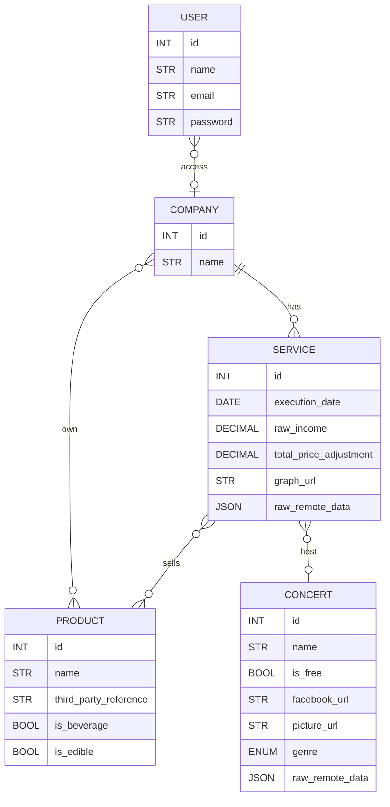

- [Notion](#notion)
- [Setup environment](#setup-environment)
  - [Install dependencies](#install-dependencies)
  - [Load the `.env_secrets.zip`](#load-the-env_secretszip)
  - [Setup local DB](#setup-local-db)
  - [Run the local server](#run-the-local-server)
- [Utils](#utils)
  - [Run virtual environment shell](#run-virtual-environment-shell)
  - [Run a shell in Flask's app context](#run-a-shell-in-flasks-app-context)
  - [Update `.env_secrets.zip`](#update-env_secretszip)
  - [Switch app from development to production](#switch-app-from-development-to-production)
  - [Put a breakpoint in program](#put-a-breakpoint-in-program)
  - [Reset the local DB](#reset-the-local-db)
- [Documentation](#documentation)
  - [How to test](#how-to-test)
  - [Diagrams](#diagrams)
    - [Entity relationship](#entity-relationship)
- [W.I.P](#wip)
  - [TO DO](#to-do)

# NOTION

https://www.notion.so/cultplace-app-0b57d24ad2424260b45ec586fa2f1ea8

# Setup environment

## Install dependencies

- Install **_app + dev_** dependencies

  ```bash
  python3 -m pipenv install --dev
  ```

- Install **_only app_** dependencies

  ```bash
  python3 -m pipenv install
  ```

## Load the `.env_secrets.zip`

> ⚠️ Be extra careful not removing `.env` file from `.gitignore`

```console
user@computer cultplace % ./load_secrets.sh
Archive:  env_secrets.zip
[env_secrets.zip] .env password: ......
inflating: .env
```

> If you add/update/remove variables from the `.env` file, see
> [how to encrypt it again for a safe commit](#update-env_secretszip)

## Setup local DB

- [Install PostgreSQL 14](https://launchschool.medium.com/how-to-install-postgresql-for-mac-os-x-61623df41f59)
- Create user `cultplace` with password "tomtom", the `cultplace` database in console (or with PGAdmin)

  ```console
  user@computer cultplace % ./create_db.sh
  ```

- Create all the tables in db

  ```console
  user@computer cultplace % cd project
  user@computer project % pipenv run Flask shell

  >>> from project import settings
  >>> settings.DB_ORM.create_all(app=app)
  ```

  - See how to reset the DB

## Run the local server

- In the virtual environment

```console
(virtualenv-222) user@computer cultplace % cd project
(virtualenv-222) user@computer project % Flask run
```

# Utils

## Run virtual environment shell

```console
user@computer cultplace % pipenv shell
```

## Run a shell in Flask's app context

- In the virtual environment

```console
(virtualenv-222) user@computer cultplace % cd project
(virtualenv-222) user@computer project % Flask run
```

## Update `.env_secrets.zip`

> Be extra careful not removing `.env` file from `.gitignore`

```console
user@computer cultplace % ./save_secrets.sh
Enter password: .....
Verify password: ....
updating: .env (deflated 44%)
```

## Switch app from development to production

- Set `FLASK_ENV` to `production` or `development` in [`.env`](.env)
- Re-run environment

```console
(virtualenv-222) user@computer cultplace % exit
Saving session...
...copying shared history...
...saving history...truncating history files...
...completed.
user@computer cultplace % pipenv shell
```

## Put a breakpoint in program

- Set a trace at the line you wish to inspect

  ```python
  import pdb
  pdb.set_trace(
      header="Just after creating this variable i wish to inspect"
  )
  ```

- Run your app, and trigger the line of code holding the trace
- Go into console and inspect your code
  - In pdb shell, you have access to :
    - any valid python code (looking at variable, etc)
    - `continue` command to resume execution of the code normally
    - `exit` or `quit` to throw an error and interrupt execution of code
    - `interact` to open a regular python shell in your current context

> This block can be put anywhere in the code, even multiple time at once
> (_use `header` arg to know at which point you are when inspection in the console_)

## Reset the local DB

- Open psql command line for database `postgres` (`psql postgres`)
- Copy/Paste this script :

```sql
SELECT
    pg_terminate_backend(pid)
FROM
    pg_stat_activity
WHERE
    -- don't kill my own connection!
    pid <> pg_backend_pid();

DROP DATABASE cultplace;

CREATE DATABASE cultplace WITH OWNER cultplace;
```

- [Reload the tables of the app in python](#setup-local-db)

# Documentation

## How to test

[See our dedicated test documentation.](./tests/test_basics.md)

## Diagrams

### Entity relationship

> 🤷🏽‍♂️ With a bit of DB explained, for the time being..

--> DEPRECATED : we're working on it



[](https://enshrined-catamaran-f8d.notion.site/image/https%3A%2F%2Fs3-us-west-2.amazonaws.com%2Fsecure.notion-static.com%2Feb6b08b1-57cb-4dc1-80f5-27a9ae4b7397%2Fcultplace_er.drawio.svg?table=block&id=61430831-0be0-46be-ae0c-33863d9d5b0c&spaceId=3b164efe-08e6-493f-8e67-7b96390085ea&userId=&cache=v2)
