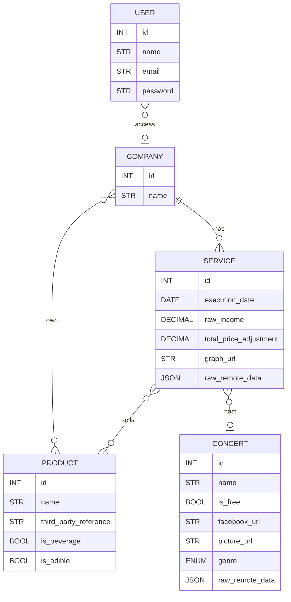

## Diagrams
### Entity relationship
> 🤷🏽‍♂️ With a bit of DB explained, for the time being..

```mermaid
erDiagram
    %% Core entities
        COMPANY {
            INT id
            STR name
        }

        COMPANY ||--o{ SERVICE : "has"
        SERVICE {
            INT id
            DATE execution_date
            DECIMAL raw_income
            DECIMAL total_price_adjustment
            STR graph_url
            JSON raw_remote_data
        }

        SERVICE }o--o{ PRODUCT : "sells"
        PRODUCT {
            INT id
            STR name
            STR third_party_reference
            BOOL is_beverage
            BOOL is_edible
        }

        COMPANY }o--o{ PRODUCT : "own"

        SERVICE }o--o| CONCERT : "host"
        CONCERT {
            INT id
            STR name
            BOOL is_free
            STR facebook_url
            STR picture_url
            ENUM genre
            JSON raw_remote_data
        }

        USER }o--o| COMPANY : access
        USER {
            INT id
            STR name
            STR email
            STR password
        }
```
