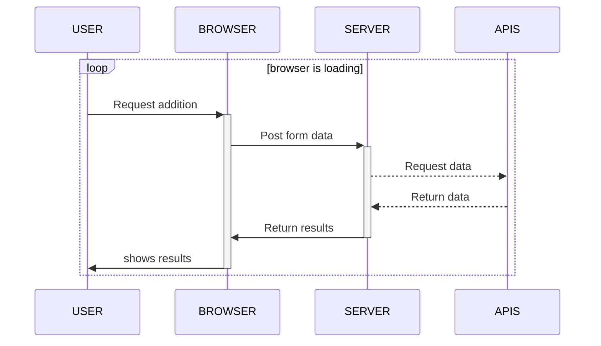
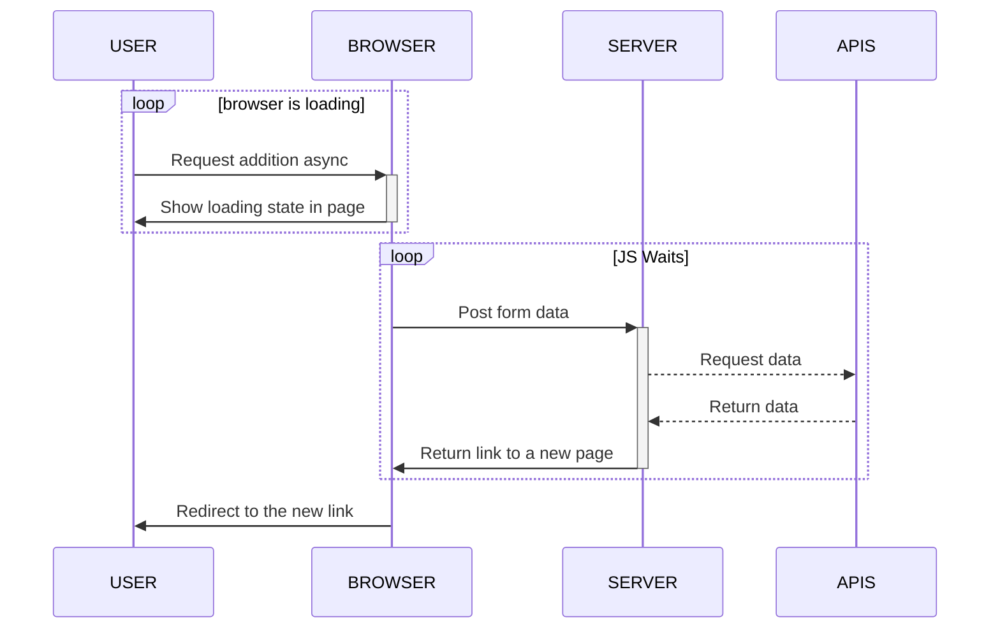

# How to Async heavy requests

> **Parler à ulysse de découplage**
## Current state of things
Problem : timeouts everywhere



---

## The FrontEnd approach

- Biblio
  - JS redirect : `window.location.href = "http://www.w3schools.com";`
  - [Fetch API](https://developer.mozilla.org/en-US/docs/Web/API/Fetch_API/Using_Fetch)


- Pros:
    - No more timeout from browser
- Limits:
  - Change nothing in the fact that the requests are way too long, and can timeout at any other point (heroku....)




Basic fetch request

```javascript
fetch('http://example.com/movies.json')
  .then(response => response.json())
  .then(data => console.log(data));
```
